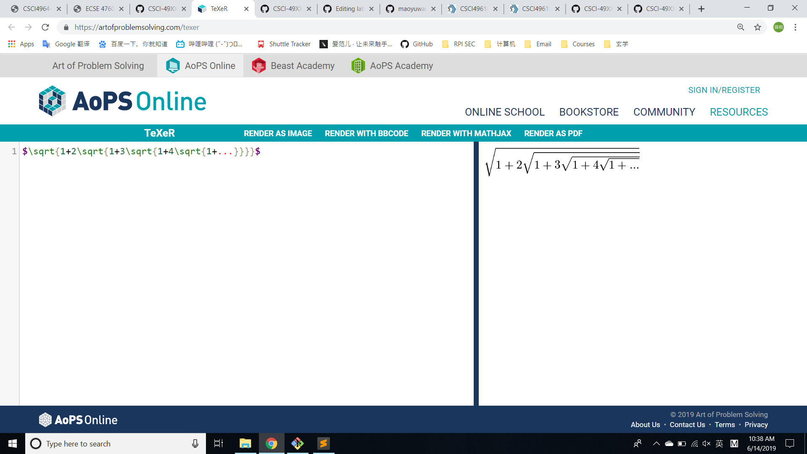
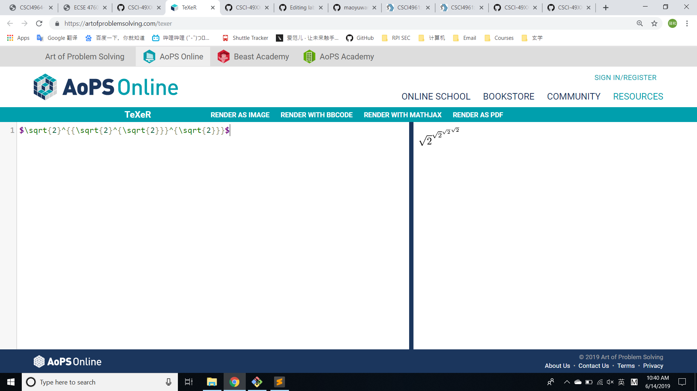
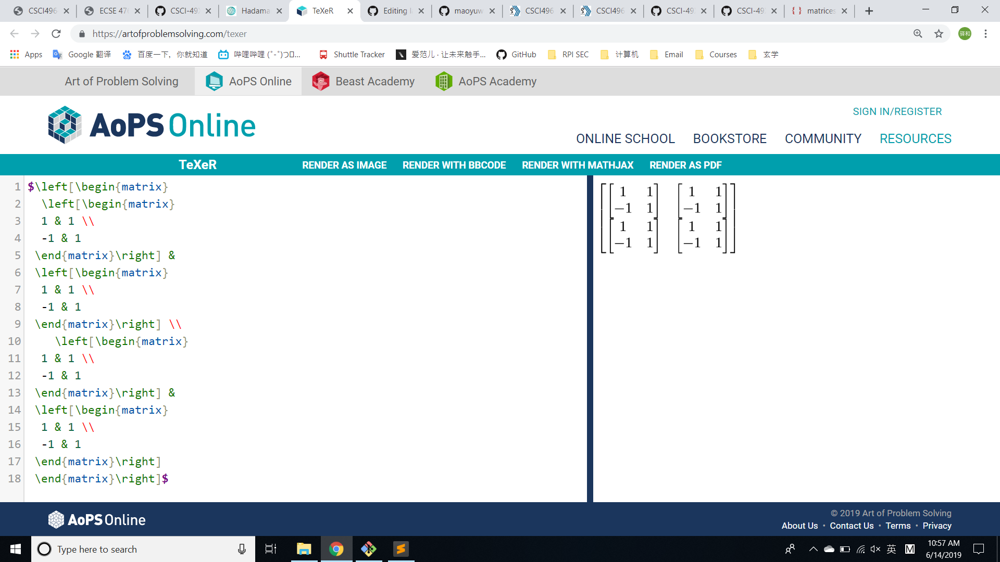
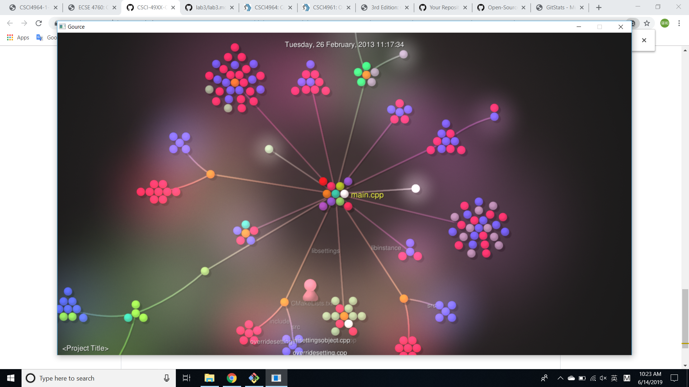
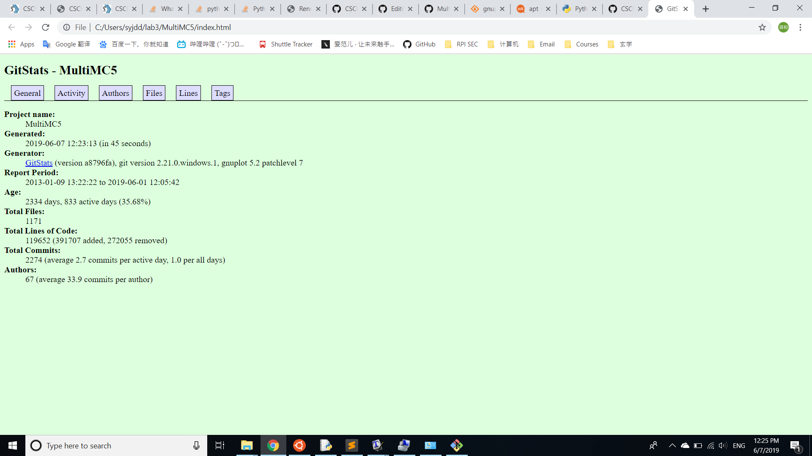

# Part1 Documentation
## Wiki link
https://github.com/syhdd/lab3/wiki/lab3-documentation
## Latex images

# Part2 Community
## MultiMC  
### The number of contributors:  
44
### Number of lines of code:  
55049
### The first commit  
Wed Jan 9 12:22:22 2013
### The latest commit  
Sat Jun 1 18:05:42 2019
### The current branches  
* develop  
  remotes/origin/HEAD -> origin/develop  
  remotes/origin/develop  
  remotes/origin/feature/artifact_overhaul  
  remotes/origin/feature/cert_pinning  
  remotes/origin/feature/offline_mode_name_choices  
  remotes/origin/feature/options_management  
  remotes/origin/feature/windows_graphics_probing  
  remotes/origin/stable  
### Gitstats  
## Gource 

